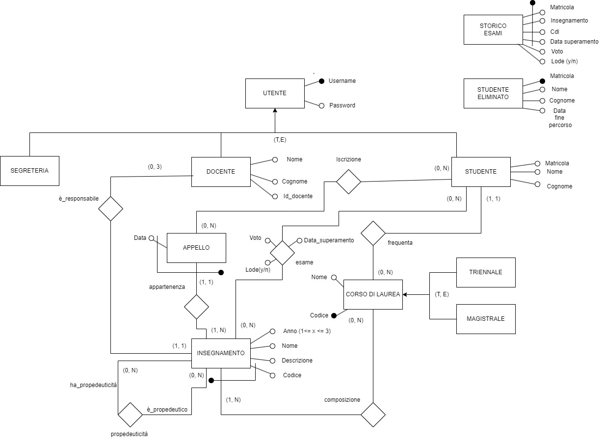

# UniversityPortal
This project is a university portal developed using PostgreSQL and PHP, designed to support the daily operations of students, faculty members, and administrative staff. The system allows students to register for exams, view course information, and manage their academic records. Professors can organize and publish exams, while the university's administration can oversee enrollments and manage academic data. The backend is powered by a relational database modeled through an Entity-Relationship diagram, ensuring consistency and integrity of the information.

## ER diagram
